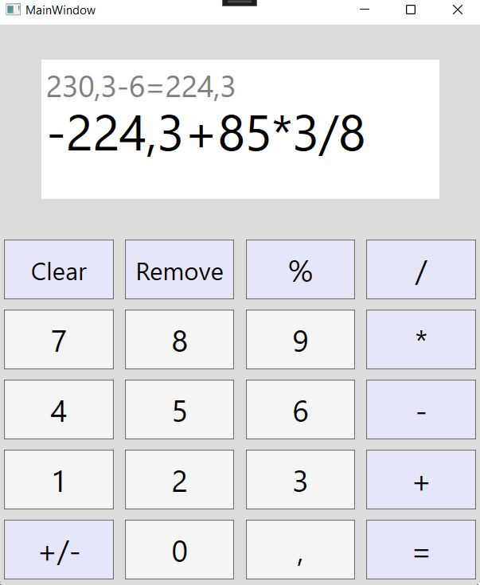

# Calculator
This is a simple calculator application that was written with a goal of learning the basics of WPF.
## Features
- All the operations that you expect from a regular calculator
- The ability to do multiple operations in a single line
- The ability to see the last calculation
## Screenshots
**The main page**

## Technologies used
- .NET Framework 4.7.2
- C# 7.3
- Visual Studio 2017
## Room for improvement
- Code refactoring
- Add brackets
- Add complex mathematical functions
- Make the app responsive to key presses
